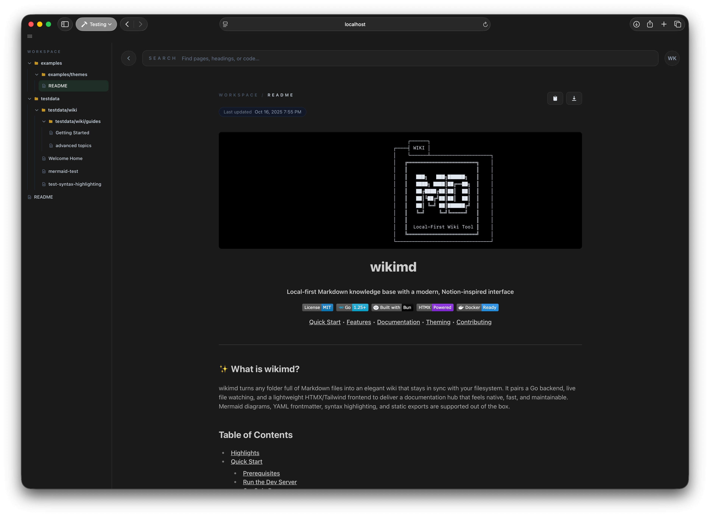

<div align="center">

```
                                   ┌──────┐                      
                              ┌────┤ WIKI │                      
                              │    └──────┴─────────────────────┐
                              │   ╔════════════════════════╗    │
                              │   ║                        ║    │
                              │   ║   ███╗   ███╗██████╗   ║    │
                              │   ║   ████╗ ████║██╔══██╗  ║    │
                              │   ║   ██╔████╔██║██║  ██║  ║    │
                              │   ║   ██║╚██╔╝██║██║  ██║  ║    │
                              │   ║   ██║ ╚═╝ ██║██████╔╝  ║    │
                              │   ║   ╚═╝     ╚═╝╚═════╝   ║    │
                              │   ║                        ║    │
                              │   ║  Local-First Wiki Tool ║    │
                              │   ╚════════════════════════╝    │
                              └─────────────────────────────────┘
```

# wikimd

**Local-first Markdown knowledge base with a modern, Notion-inspired interface**

[](https://opensource.org/licenses/MIT)
[](https://go.dev/)
[](https://bun.sh)
[](https://htmx.org)
[](https://hub.docker.com)

[Quick Start](#-quick-start) • [Features](#-highlights) • [Documentation](#table-of-contents) • [Theming](#-theming) • [Contributing](#-contributing)

</div>

---

<div align="center">



</div>

---

## ✨ What is wikimd?

wikimd turns any folder full of Markdown files into an elegant wiki that stays in sync with your filesystem. It pairs a Go backend, live file watching, and a lightweight HTMX/Tailwind frontend to deliver a documentation hub that feels native, fast, and maintainable. Mermaid diagrams, YAML frontmatter, syntax highlighting, and static exports are supported out of the box.

## Table of Contents
- [Highlights](#highlights)
- [Quick Start](#quick-start)
  - [Installation](#installation)
    - [Homebrew (macOS/Linux)](#homebrew-macoslinux)
    - [From Source](#from-source)
  - [Docker](#docker)
- [Configuration](#configuration)
- [Theming](#theming)
  - [Quick Start](#theming-quick-start)
  - [Available Themes](#available-themes)
  - [Creating Custom Themes](#creating-custom-themes)
- [User Experience](#user-experience)
- [Static Export CLI](#static-export-cli)
  - [Single Page Export API](#single-page-export-api)
- [Markdown Capabilities](#markdown-capabilities)
- [Architecture](#architecture)
- [Roadmap](#roadmap)
- [Contributing](#contributing)
- [License](#license)

## 🎯 Highlights

- **📁 Local-first workspace** — Watches your Markdown directory and streams updates over Server-Sent Events—no manual refreshes.
- **🎨 Notion-inspired UI** — Resizable navigation tree, breadcrumb-aware page view, fully customizable CSS theming system.
- **⚡ Keyboard-friendly search** — ripgrep-powered full-text search exposed through a Cmd/Ctrl+K palette with inline results.
- **✍️ Markdown superpowers** — GitHub-flavored Markdown, Mermaid.js diagrams, syntax highlighting, and frontmatter metadata.
- **🧩 Diagram power** — First-class Mermaid plus server-side, dark-themed D2 rendering that honors whatever layout engine you specify in the diagram itself, so visuals survive static exports.
- **🚀 Ship anywhere** — Bundled Tailwind assets and a static export CLI ready for Netlify, GitHub Pages, or offline archives.
- **🔗 Deep-linkable docs** — Automatic heading permalinks and live breadcrumb updates make sharing sections effortless.
- **👥 Built for teams** — REST endpoints for create/rename/delete, change notifications, and optional JSON APIs for integrations.

## 🚀 Quick Start

### Installation

#### Homebrew (macOS/Linux)
```bash
brew tap euforicio/taps
brew install wikimd

# Start the wiki server
wikimd --root ~/my-wiki
```

#### From Source

**Prerequisites:**
- Go 1.25+
- bun 1.x (runs Tailwind + JavaScript build/watch)
- ripgrep (`rg`) on your `PATH` for instant search
- macOS, Linux, or Windows (auto-open browser support for all three)

**Run the Dev Server:**
```bash
git clone https://github.com/euforicio/wikimd.git
cd wikimd
bun install --cwd web
make dev
```

`make dev` launches the frontend toolchain in watch mode and the Go server with live asset rebuilding. By default the wiki auto-selects an available port and points at the current working directory for content. The server URL will be displayed when it starts.

**Go-Only Run:**
If you already have the assets built, you can skip bun and run the server directly:
```bash
go run ./cmd/wikimd --root ./docs --port 8081 --auto-open=false
```

To build the web assets without running the dev server:
```bash
go generate    # Builds CSS and JS bundles
# or
make web-build
```

Need build metadata for diagnostics? Run:
```bash
go run ./cmd/wikimd --version
```
to print the embedded version, commit, and build timestamp.

#### Docker
Build and run a containerized server:
```bash
make docker
# Mount a specific directory (e.g., docs folder)
docker run --rm -p 8080:8080 \
  -v "$PWD/docs:/data" \
  wikimd:latest

# Or mount current directory to browse all your markdown files
docker run --rm -p 8080:8080 \
  -v "$PWD:/data" \
  wikimd:latest
```

The container defaults to `--root /data --port 8080 --auto-open=false` for convenience. Override with your own flags if needed. The server includes ripgrep for full-text search functionality.

## ⚙️ Configuration

Flags mirror environment variables (prefixed with `WIKIMD_`):

| Flag | Env | Description |
| --- | --- | --- |
| `--root`, `-r` | `WIKIMD_ROOT` | Root directory containing Markdown documents (default: current directory). |
| `--port`, `-p` | `WIKIMD_PORT` | HTTP port (default: `0` for auto-select). Specify a port like `8080` for a fixed port. |
| `--auto-open` | `WIKIMD_AUTO_OPEN` | Automatically open the default browser after startup (default: true). |
| `--assets` | `WIKIMD_ASSETS` | Override the directory for built frontend assets. |
| `--out` | `WIKIMD_OUT` | Default output directory for exports (default: `dist`). |
| `--verbose`, `-v` | `WIKIMD_VERBOSE` | Enable request logging and additional diagnostics. |

All paths are normalized and validated to prevent accidental traversal outside your wiki root.

## 🎨 Theming

wikimd supports CSS-only theming through custom CSS files. Customize colors, fonts, spacing, and more without modifying any code!

### Theming Quick Start

**Global Theme** (applies to all wikis):
```bash
mkdir -p ~/.wikimd
cp examples/themes/solarized-dark.css ~/.wikimd/custom.css
```

**Per-Wiki Theme** (specific to one wiki):
```bash
mkdir -p <your-wiki>/.wikimd
cp examples/themes/dark.css <your-wiki>/.wikimd/custom.css
```

Changes take effect immediately—just refresh your browser!

### Available Themes

wikimd ships with three example themes in `examples/themes/`:

- **Dark** (`dark.css`): Enhanced contrast dark theme with deep blacks and bright text, perfect for late-night sessions.
- **Solarized Dark** (`solarized-dark.css`): Classic Solarized color scheme with low contrast and eye-friendly colors.
- **Light** (`light.css`): Clean and bright light theme for daytime use.

### Creating Custom Themes

CSS files are loaded in this priority order (later styles override earlier):
1. **Embedded defaults** → Built-in dark theme
2. **Global custom** → `~/.wikimd/custom.css` (your personal theme)
3. **Per-wiki custom** → `<wiki-root>/.wikimd/custom.css` (project-specific)

You can override any CSS variable to create your own theme. Here's a minimal example:

```css
/* Purple Theme */
:root {
  --color-accent: #a78bfa;
  --color-accent-hover: #8b5cf6;
  --color-text-link: #c084fc;
  --color-sidebar-active: #a78bfa;
}
```

For a complete list of customizable variables and detailed theming guide, see [`examples/themes/README.md`](examples/themes/README.md).

## 💫 User Experience
- **Live navigation tree:** File watcher keeps the sidebar synchronized with the filesystem; edits from other tools appear instantly.
- **Streaming updates:** Server-Sent Events push create, update, delete notifications so open pages refresh without losing scroll position.
- **Search everywhere:** Cmd/Ctrl+K summons a spotlight-style search panel powered by ripgrep, with context snippets and keyboard navigation.
- **Customizable theming:** Pure CSS theming system with global and per-wiki theme support—see example themes in `examples/themes/`.
- **Link-aware rendering:** Relative `.md` links are rewritten to in-app routes, enabling seamless wiki-style navigation.
- **Code ergonomics:** One-click copy buttons on code blocks, syntax highlighting via Chroma, and responsive layout for wide monitors.

## 📦 Static Export CLI
The companion binary `wikimd-export` converts your Markdown tree into a portable static site.

```bash
go run ./cmd/wiki-export \
  --root ./docs \
  --out ./dist \
  --title "Project Wiki" \
  --search-index \
  --base-url https://example.com/wiki
```

Key options:
- `--asset-prefix`: Where bundled CSS/JS land inside the export (default: `assets`).
- `--hidden`: Include dotfiles in the generated tree.
- `--search-index`: Emit a JSON index for simple client-side search widgets.
- `--clean=false`: Skip wiping the output directory before writing.
- Prefer `make export` for a one-liner that wires the same flags through environment variables.

Exports reuse the same renderer as the live app, so Markdown, Mermaid, and metadata render identically.

### Single Page Export API
Need to grab one document without generating a full static bundle? The server exposes `GET /api/export`, which streams a single page as HTML, PDF, Markdown, or plain text. Pass the wiki-relative Markdown path (including `.md`) and desired format:

```bash
curl "http://localhost:8080/api/export?path=guides/getting_started.md&format=pdf" \
  -o getting-started.pdf
```

Supported `format` values: `html`, `pdf`, `markdown`, `txt`. Responses include a sensible `Content-Disposition` header so browsers download the file with a clean filename.

## ✍️ Markdown Capabilities
- GitHub-flavored Markdown extensions (tables, task lists, strikethrough, autolinks).
- YAML frontmatter for `title`, `description`, `tags`, and arbitrary metadata.
- Mermaid.js diagrams themed for dark/light modes with automatic re-rendering on theme changes.
- Server-side rendered D2 diagrams that ship in a dark palette by default, respect in-file layout directives (dagre, ELK, TALA, etc.), and embed SVG for static exports and PDFs.
- Automatic breadcrumb generation and friendly document titles derived from file paths.
- Automatic heading permalinks for copy-and-share anchors on every section.
- Raw HTML support for advanced layouts and styling (safe for local-only wikis with trusted content).

## 🏗️ Architecture
- **Go backend:** Standard library HTTP server with SSE, REST APIs, and graceful shutdown.
- **Content service:** fsnotify-backed watcher caches the document tree and broadcasts changes to subscribers.
- **Renderer:** Goldmark + Chroma pipeline caches rendered output by modification time for speed.
- **Search:** Thin wrapper over ripgrep for reliable, blazing-fast full-text queries.
- **Frontend:** HTMX interactions, Tailwind styles, and Bun build tooling packaged into an embedded asset bundle for releases.
- **Security middleware:** CSRF protection for mutating endpoints plus gzip + logging wrappers to harden the HTTP surface.

## 🗺️ Roadmap
Upcoming work includes possible rich editing workflows, more export formats, collaborative session hooks, etc...

## 🤝 Contributing
Pull requests are welcome! To get started:
- Fork and clone the repository.
- Run `bun install --cwd web` and `make dev` to boot the full stack.
- Prefer `go test ./...` and `go generate` (or `bun --cwd web run build`) before submitting changes.
- Please open an issue for substantial feature proposals so we can align on direction first.

## 📄 License
Released under the MIT License. See `LICENSE` for details.

---

<div align="center">

[⭐ Star on GitHub](https://github.com/euforicio/wikimd)

**Built with ❤️ using Go, HTMX, and Tailwind CSS** 

</div>
