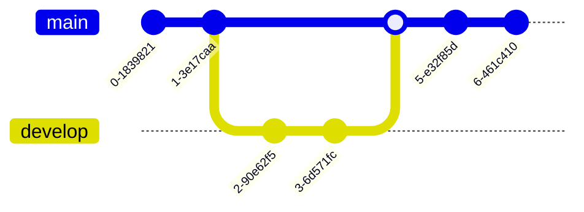

# Mermaid Diagram Tests

This page tests various mermaid diagram types in dark mode.

## Flowchart

## Sequence Diagram

## Class Diagram

## State Diagram

## Entity Relationship Diagram

## Pie Chart

## Git Graph

## User Journey

## Gantt Chart

