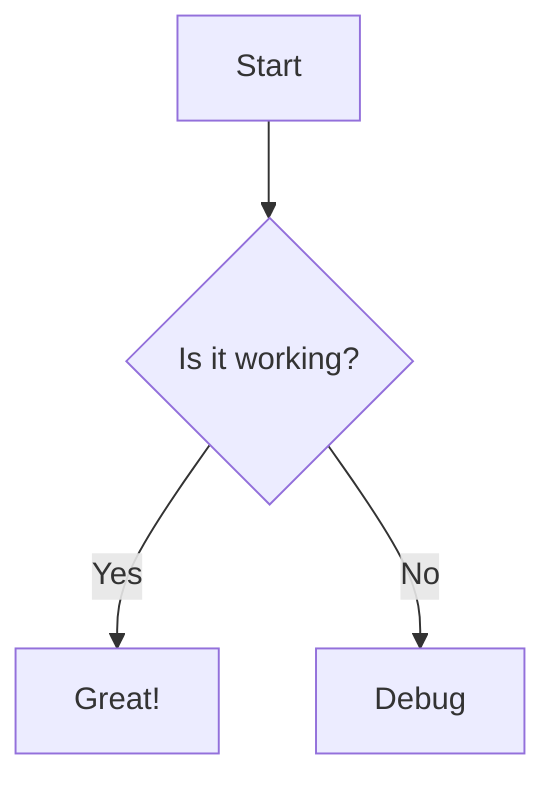

# Syntax Highlighting Test

This page tests code syntax highlighting.

## JavaScript Example

```javascript
function hello(name) {
  console.log(`Hello, ${name}!`);
  return true;
}
```

## Python Example

```python
def factorial(n):
    if n <= 1:
        return 1
    return n * factorial(n - 1)
```

## Go Example

```go
package main

import "fmt"

func main() {
    fmt.Println("Hello, World!")
}
```

## JSON Example

```json
{
  "name": "test",
  "version": "1.0.0",
  "dependencies": {
    "express": "^4.18.0"
  }
}
```

## YAML Example

```yaml
name: test
version: 1.0.0
dependencies:
  - express
  - react
```

## Plain Code (no language)

```
plain text code block
no language specified
should still have basic formatting
```

## Mermaid Diagram


